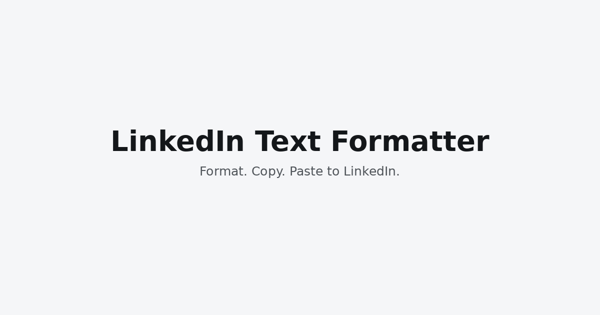
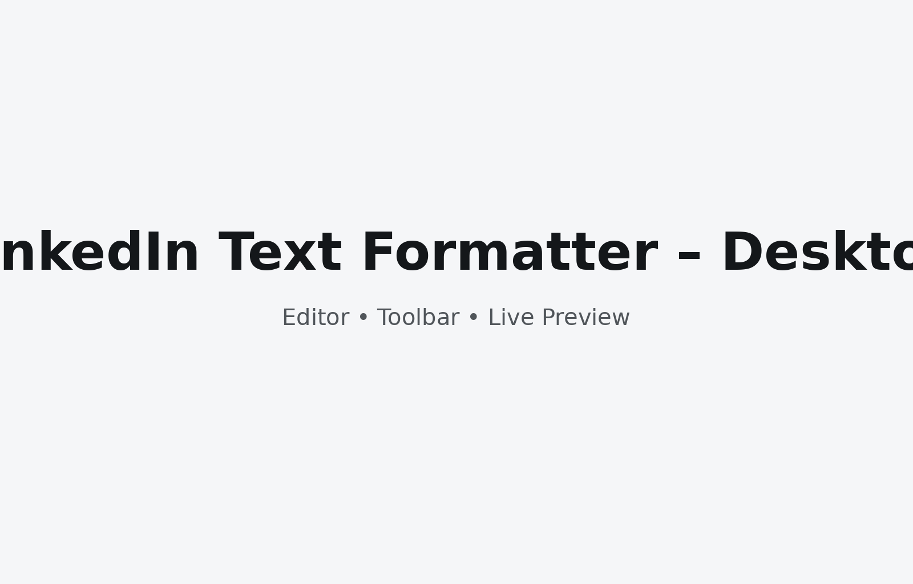
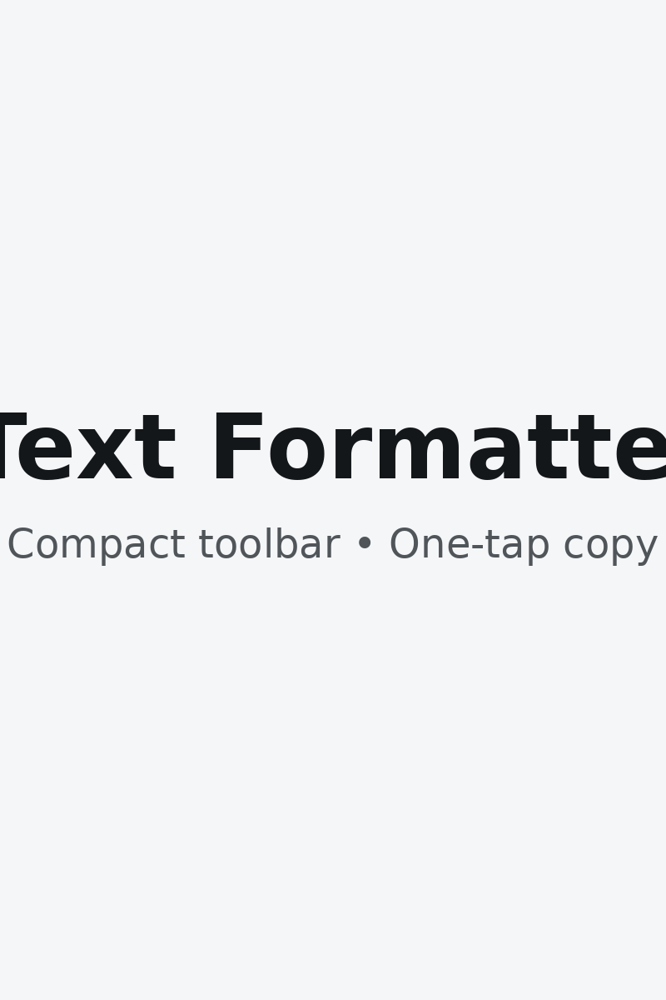

<h1 align="center">LinkedIn Text Formatter</h1>

<p align="center">
  <em>Format text with bold, italic, underline, and strikethrough that survives paste into LinkedIn posts.</em>
</p>

<p align="center">
  <!-- Badges: replace <Lewis502> and <linkedin-text-formatter> with your GitHub handle and repo name -->
  <a href="https://lewis502.github.io/linkedin-text-formatter/">
    
    
  </a>
  
  
  /<your-repo>">
  /<your-repo>">
  /<your-repo>?style=social">
</p>

<p align="center">
  
</p>

---

## Live demo

**https://lewis502.github.io/linkedin-text-formatter/**  
*(Enable GitHub Pages: Settings → Pages → “Deploy from a branch”, Branch: `main`, Folder: `/`)*

## What this does

LinkedIn text posts don’t allow HTML. This app applies Unicode look‑alike characters and combining marks so that **bold**, *italic*, __underline__, and ~~strikethrough~~ paste correctly into a LinkedIn post. It’s entirely client‑side—no data leaves your browser.

### Features
- ✅ Live preview of formatted output
- ✅ One‑click **Copy** (falls back gracefully if clipboard permissions are denied)
- ✅ Mini‑Markdown support on copy: `***bold italic***`, `**bold**`, `*italic*`, `__underline__`, `~~strike~~`
- ✅ “Normalize” button to strip styling back to plain text
- ✅ Keyboard shortcuts and accessible labels
- ✅ No build step; static files only (HTML/CSS/JS)

## Screenshots

### Desktop


### Mobile


## Quick start

1. Clone or download this repository.
2. Open `index.html` directly in your browser **or** serve it locally:
   ```bash
   # Option A: Python 3
   python -m http.server 8000
   # Option B: Node (npx serve)
   npx serve .
   ```
3. Visit `http://localhost:8000` (if using a local server).

## How it works (in brief)

- Applies **Unicode Mathematical Alphanumeric Symbols** for bold/italic and combining marks for underline/strikethrough.  
- Because the output is plain text, it survives paste into LinkedIn *posts* (not articles).  
- Some fonts/browsers render certain glyphs slightly differently—test your post before publishing.

## Limitations & notes

- Works for **LinkedIn text posts**. LinkedIn Articles have a separate rich‑text editor.  
- Don’t overuse styled characters for long paragraphs; screen readers may pronounce characters letter‑by‑letter. Provide a plain‑text alternative when accessibility matters.  
- Underline/strikethrough use combining marks; a few legacy fonts render them imperfectly.

## Contributing

Contributions are welcome!

- Fork → branch → commit → PR.  
- Please read **CONTRIBUTING.md** and the **Code of Conduct**.  
- Use clear commit messages and add before/after screenshots for UI changes.

## Badges you can customize

Replace placeholders in the badge URLs:
- `<your-username>` → your GitHub username
- `<your-repo>` → your repository name

Useful additional shields:
- Downloads badge (for releases): `https://img.shields.io/github/downloads/<your-username>/<your-repo>/total`
- Bundle size (if you add a build): `https://img.shields.io/bundlephobia/minzip/your-package`

## License

MIT © You. See **LICENSE** for details.

## Acknowledgements

- Unicode “Mathematical Alphanumeric Symbols” block
- The open‑source community for feedback and contributions
